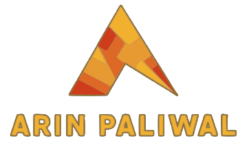

<div align="center">
        <a href=""></a>
</div>

<br><br>

 <div align="center">

[]()

 </div>
 
 <div align="center">
  
 [](https://visitcount.itsvg.in)
  
<br>
  
 </div>
 
 
# About Me:

<div align="center">
    <div style="float: left; text-align: left; width: 70%;">
        <h2>🔭 I’m currently working on Web Development and Problem Solving.<br>👯 I’m looking to collaborate on Full Stack Development and Machine Learning Projects.<br>🌱 I’m actively learning <span style="color:red">Data Structures & Algorithms</span> and steadily improving my understanding of them.</h2>
    </div>
    <div style="float: right; text-align: right; width: 30%;">
        
    </div>
</div>
        
# Connect with me:&nbsp;&nbsp;&nbsp;&nbsp;<a href="https://portfolio-arin.netlify.app/" target="_blank" ></a>

<div align="center";style="display: flex; align-items:center; justify-content: center; gap: 20px;">
    <a href="https://linkedin.com/in/arinpaliwal"target="_blank"></a>&nbsp;&nbsp;&nbsp;&nbsp;
    <a href="https://twitter.com/arin_paliwal"target="_blank"></a>&nbsp;&nbsp;&nbsp;&nbsp;
    <a href="https://facebook.com/paliwal.arin"target="_blank"></a>&nbsp;&nbsp;&nbsp;&nbsp;
    <a href="https://www.instagram.com/arin.paliwal/"target="_blank"></a>&nbsp;&nbsp;&nbsp;&nbsp;
    <a href="https://discord.gg/rASr9bPbkb"target="_blank"></a>&nbsp;&nbsp;&nbsp;&nbsp;
</div>

<br>

# 💻 Tech Stack:

## Frontend

<div align="center">  
<a href="https://reactjs.org/" target="_blank"></a>  
<a href="https://getbootstrap.com/docs/3.4/javascript/" target="_blank"></a>  
<a href="https://www.w3schools.com/css/" target="_blank"></a>  
<a href="https://en.wikipedia.org/wiki/HTML5" target="_blank"></a>  
<a href="https://www.javascript.com/" target="_blank"></a>  
<a href="https://www.typescriptlang.org/" target="_blank"></a>  
<a href="https://www.tailwindcss.com/" target="_blank"></a>  
<a href="https://chakra-ui.com/" target="_blank"></a>  
<a href="https://mui.com/" target="_blank"></a>  
</div>

## Backend

<div align="center">  
<a href="https://www.cplusplus.com/" target="_blank"></a>  
<a href="https://www.djangoproject.com/" target="_blank"></a>  
<a href="https://www.java.com/" target="_blank"></a>  
<a href="https://nodejs.org/" target="_blank"></a>  
<a href="https://www.mongodb.com/" target="_blank" rel="noreferrer">  </a>
<a href="https://www.python.org/" target="_blank"></a>  
<a href="https://redux.js.org/" target="_blank"></a>  
<a href="https://expressjs.com/" target="_blank"></a>  
<a href="https://flask.palletsprojects.com/" target="_blank"></a>  
<a href="https://nextjs.org/" target="_blank"></a>  
</div>

## Tools

<div align="center">  
<a href="https://github.com/" target="_blank"></a>  
<a href="https://postman.com" target="_blank" rel="noreferrer">  </a>
<a href="https://www.gnu.org/software/bash/" target="_blank"></a>  
<a href="https://www.figma.com/" target="_blank"></a>  
<a href="https://www.adobe.com/in/products/photoshop.html" target="_blank"></a>  
<a href="https://pytorch.org/" target="_blank"></a>  
<a href="https://www.adobe.com/in/products/xd.html" target="_blank"></a>  
</div>

<div align="center">
 <br>

# 📊 GitHub Stats:

[](https://github.com/arin-paliwal/arin-paliwal)

<p></p>

[](https://github.com/arin-paliwal/arin-paliwal)

</div>

[]()

<div align="center">


</div>

<!--START_SECTION:waka-->

```rust
From: 30 July 2023 - To: 06 July 2024

Total Time: 679 hrs 33 mins

JavaScript        418 hrs 42 mins >>>>>>>>>>>>>>>----------   61.36 %
TypeScript        116 hrs 32 mins >>>>---------------------   17.08 %
Python            77 hrs 52 mins  >>>----------------------   11.41 %
JSON              14 hrs 33 mins  >------------------------   02.13 %
Java              10 hrs 30 mins  -------------------------   01.54 %
HTML              9 hrs 18 mins   -------------------------   01.36 %
CSS               7 hrs 23 mins   -------------------------   01.08 %
Text              4 hrs 7 mins    -------------------------   00.60 %
Git Config        3 hrs 16 mins   -------------------------   00.48 %
Bash              2 hrs 56 mins   -------------------------   00.43 %
```

<!--END_SECTION:waka-->
