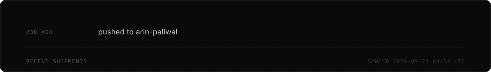

<!--
  ────────────────────────────────────────────────────────────
  arin-paliwal · profile readme
  every visual is a hand-crafted animated svg with geist embedded
  ────────────────────────────────────────────────────────────
-->

  <picture>
    <source media="(prefers-color-scheme: dark)" srcset="assets/hero-dark.svg">
    <source media="(prefers-color-scheme: light)" srcset="assets/hero-light.svg">
    
  </picture>

  

  

  <picture>
    <source media="(prefers-color-scheme: dark)" srcset="assets/about-dark.svg">
    <source media="(prefers-color-scheme: light)" srcset="assets/about-light.svg">
    
  </picture>

  

  <picture>
    <source media="(prefers-color-scheme: dark)" srcset="assets/toolbox-dark.svg">
    <source media="(prefers-color-scheme: light)" srcset="assets/toolbox-light.svg">
    
  </picture>

  

  <picture>
    <source media="(prefers-color-scheme: dark)" srcset="assets/stats-dark.svg">
    <source media="(prefers-color-scheme: light)" srcset="assets/stats-light.svg">
    
  </picture>

 

  <picture>
    <source media="(prefers-color-scheme: dark)" srcset="assets/activity-dark.svg">
    <source media="(prefers-color-scheme: light)" srcset="assets/activity-light.svg">
    
  </picture>

 

  <picture>
    <source media="(prefers-color-scheme: dark)" srcset="https://raw.githubusercontent.com/arin-paliwal/arin-paliwal/output/pacman-contribution-graph-dark.svg">
    <source media="(prefers-color-scheme: light)" srcset="https://raw.githubusercontent.com/arin-paliwal/arin-paliwal/output/pacman-contribution-graph.svg">
    
  </picture>

  

  <picture>
    <source media="(prefers-color-scheme: dark)" srcset="assets/game-board-dark.svg">
    <source media="(prefers-color-scheme: light)" srcset="assets/game-board-light.svg">
    
  </picture>

  
  
  
  
  
  
  

  

  &#160;&#160;
  &#160;&#160;
  &#160;&#160;
  

 

<!--
  SPOTIFY NOW PLAYING — one-time setup:
  1. Open https://spotify-github-profile.kittinanx.com and log in with Spotify.
  2. Copy the generated image URL (it contains your uid).
  3. Replace SPOTIFY_UID below and delete this comment block's markers.

  

-->

 

  <picture>
    <source media="(prefers-color-scheme: dark)" srcset="assets/footer-dark.svg">
    <source media="(prefers-color-scheme: light)" srcset="assets/footer-light.svg">
    
  </picture>

