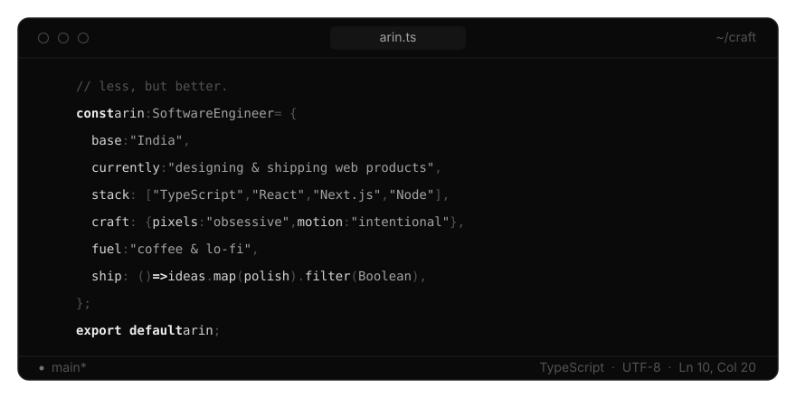

<!--
  ────────────────────────────────────────────────────────────
  arin-paliwal · profile readme
  hand-crafted animated svgs · embedded geist typography
  no templates, no generators — view source, it's all here
  ────────────────────────────────────────────────────────────
-->

<div align="center">
  <picture>
    <source media="(prefers-color-scheme: dark)" srcset="assets/hero-dark.svg">
    <source media="(prefers-color-scheme: light)" srcset="assets/hero-light.svg">
    
  </picture>
</div>

<div align="center">
  
</div>

<br>

<div align="center">
  
</div>

<h3 align="center"><samp>01 · about</samp></h3>

<br>

<table width="100%">
  <tr>
    <td width="46%" valign="middle">
      <p>
        I'm a software engineer from India who believes the last 5% of a product —
        the spacing, the motion, the empty states — is where the craft lives.
        I spend my days building web platforms and my nights building small,
        polished products of my own.
      </p>
      <p>
        <samp>now&nbsp;&nbsp;&nbsp;&nbsp;</samp> engineering frontend platforms at <strong>Simpplr</strong><br>
        <samp>building</samp> <strong>Wrapr</strong>, <strong>Iris</strong> &amp; other personal products<br>
        <samp>learning</samp> AI agents &amp; design engineering<br>
        <samp>values&nbsp;</samp> less, but better
      </p>
    </td>
    <td width="54%" valign="middle">
      <picture>
        <source media="(prefers-color-scheme: dark)" srcset="assets/code-card-dark.svg">
        <source media="(prefers-color-scheme: light)" srcset="assets/code-card-light.svg">
        
      </picture>
    </td>
  </tr>
</table>

<br>

<div align="center">
  
</div>

<h3 align="center"><samp>02 · toolbox</samp></h3>

<br>

<div align="center">

| | |
| ---------------: | :--------------------------------------------------------------- |
|   **languages**  | TypeScript · JavaScript · Python · SQL                            |
|    **frontend**  | React · Next.js · Redux · Zustand · Tailwind CSS · Framer Motion  |
|     **backend**  | Node.js · Express · Django · Flask                                |
|        **data**  | MongoDB · Supabase · PostgreSQL                                   |
|      **design**  | Figma · design systems · typography · motion                      |
|     **tooling**  | Git · pnpm · Vite · Vercel · Postman                              |

</div>

<br>

<div align="center">
  
</div>

<h3 align="center"><samp>03 · selected builds</samp></h3>

<br>

<table width="100%">
  <tr>
    <td width="33.3%" valign="top">
      <h4>Wrapr</h4>
      <p><sub>A personal life-ops platform. Ledger, expenses, reminders, bills and visitors, designed and run like a real product with its own SDK and backend.</sub></p>
      <p><sub><samp>next.js · django</samp></sub></p>
    </td>
    <td width="33.3%" valign="top">
      <h4>Iris</h4>
      <p><sub>A privacy-first visitor analytics SDK. Never throws into the host app, never blocks render, 7.7&nbsp;kB gzipped on the critical path.</sub></p>
      <p><sub><samp>typescript · sdk</samp></sub></p>
    </td>
    <td width="33.3%" valign="top">
      <h4>Agent Insight</h4>
      <p><sub>A bot detection and user-agent analysis platform with real-time traffic insights and a clean operational dashboard.</sub></p>
      <p><sub><samp>react · vite</samp></sub></p>
    </td>
  </tr>
</table>

<br>

<div align="center">
  
</div>

<h3 align="center"><samp>04 · by the numbers</samp></h3>

<br>

<div align="center">
  <picture>
    <source media="(prefers-color-scheme: dark)" srcset="https://github-readme-stats.vercel.app/api?username=arin-paliwal&show_icons=true&hide_border=true&bg_color=00000000&text_color=8a8a8a&title_color=ededed&icon_color=8a8a8a&ring_color=ededed&include_all_commits=true&count_private=true">
    <source media="(prefers-color-scheme: light)" srcset="https://github-readme-stats.vercel.app/api?username=arin-paliwal&show_icons=true&hide_border=true&bg_color=00000000&text_color=525252&title_color=171717&icon_color=525252&ring_color=171717&include_all_commits=true&count_private=true">
    
  </picture>
  <picture>
    <source media="(prefers-color-scheme: dark)" srcset="https://streak-stats.demolab.com?user=arin-paliwal&hide_border=true&background=00000000&stroke=00000000&ring=ededed&fire=ededed&currStreakNum=ededed&sideNums=ededed&currStreakLabel=8a8a8a&sideLabels=8a8a8a&dates=525252">
    <source media="(prefers-color-scheme: light)" srcset="https://streak-stats.demolab.com?user=arin-paliwal&hide_border=true&background=00000000&stroke=00000000&ring=171717&fire=171717&currStreakNum=171717&sideNums=171717&currStreakLabel=525252&sideLabels=525252&dates=a3a3a3">
    
  </picture>
</div>

<br>

<div align="center">
  <picture>
    <source media="(prefers-color-scheme: dark)" srcset="https://github-readme-stats.vercel.app/api/top-langs/?username=arin-paliwal&layout=compact&hide_border=true&bg_color=00000000&text_color=8a8a8a&title_color=ededed&langs_count=8&hide=Jupyter%20Notebook&exclude_repo=Diabetes-Prediction-System&card_width=440">
    <source media="(prefers-color-scheme: light)" srcset="https://github-readme-stats.vercel.app/api/top-langs/?username=arin-paliwal&layout=compact&hide_border=true&bg_color=00000000&text_color=525252&title_color=171717&langs_count=8&hide=Jupyter%20Notebook&exclude_repo=Diabetes-Prediction-System&card_width=440">
    
  </picture>
</div>

<br>

<div align="center">
  <picture>
    <source media="(prefers-color-scheme: dark)" srcset="https://github-readme-activity-graph.vercel.app/graph?username=arin-paliwal&bg_color=0d1117&hide_border=true&color=8a8a8a&line=525252&point=ededed&area=true&area_color=8a8a8a&hide_title=true">
    <source media="(prefers-color-scheme: light)" srcset="https://github-readme-activity-graph.vercel.app/graph?username=arin-paliwal&bg_color=ffffff&hide_border=true&color=525252&line=d4d4d4&point=171717&area=true&area_color=d4d4d4&hide_title=true">
    
  </picture>
</div>

<br>

<div align="center">
  <picture>
    <source media="(prefers-color-scheme: dark)" srcset="https://raw.githubusercontent.com/arin-paliwal/arin-paliwal/output/github-snake-dark.svg">
    <source media="(prefers-color-scheme: light)" srcset="https://raw.githubusercontent.com/arin-paliwal/arin-paliwal/output/github-snake.svg">
    
  </picture>
</div>

<br>

<!--START_SECTION:waka-->

```rust
From: 30 July 2023 - To: 29 August 2026

Total Time: 1,876 hrs 14 mins

JavaScript                 813 hrs 1 min         >>>>>>>>>>>--------------   42.71 %
TypeScript                 722 hrs 35 mins       >>>>>>>>>----------------   37.96 %
Python                     163 hrs 25 mins       >>-----------------------   08.58 %
HTML                       33 hrs 45 mins        -------------------------   01.77 %
Other                      27 hrs 20 mins        -------------------------   01.44 %
```

<!--END_SECTION:waka-->

<div align="center">
  
</div>

<h3 align="center"><samp>05 · connect</samp></h3>

<br>

<div align="center">
  <a href="https://arinpaliwal.vercel.app"><code>&nbsp;portfolio&nbsp;↗&nbsp;</code></a>&nbsp;&nbsp;
  <a href="https://linkedin.com/in/arinpaliwal"><code>&nbsp;linkedin&nbsp;↗&nbsp;</code></a>&nbsp;&nbsp;
  <a href="https://twitter.com/arin_paliwal"><code>&nbsp;x&nbsp;/&nbsp;twitter&nbsp;↗&nbsp;</code></a>&nbsp;&nbsp;
  <a href="mailto:paliwalarin09@gmail.com"><code>&nbsp;email&nbsp;↗&nbsp;</code></a>
</div>

<br>

<details>
<summary><samp>&nbsp;colophon — how this page was made</samp></summary>
<br>

- Every banner on this page (hero, ticker, dividers, code window, footer) is a **hand-written animated SVG** committed to this repo. No generators, no template services.
- The typography is **Geist**, embedded directly inside each SVG as a base64 `@font-face`, so it renders identically for every visitor on every OS.
- Animations (the typing code, the rotating title, the shimmer lines) are pure **CSS keyframes inside the SVGs**. GitHub happily plays them.
- Everything ships in **adaptive pairs**. The page follows your GitHub theme via `<picture>` + `prefers-color-scheme`.
- Palette: monochrome. `#0a0a0a` to `#ededed` and the greys in between. One green dot, because status lights deserve to be green.

</details>

<br>

<div align="center">
  <picture>
    <source media="(prefers-color-scheme: dark)" srcset="assets/footer-dark.svg">
    <source media="(prefers-color-scheme: light)" srcset="assets/footer-light.svg">
    
  </picture>
</div>
